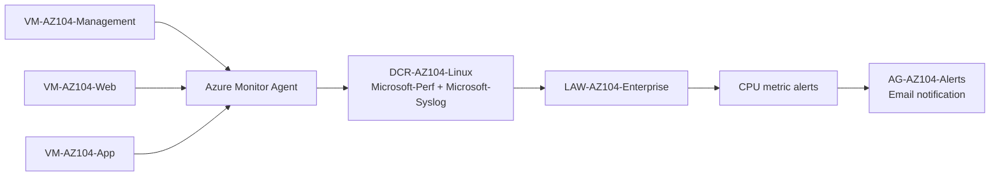

# Azure Monitor Implementation

This lab documents the monitoring chain completed for the three Linux VMs in the enterprise AZ-104 environment.

## Implemented resources

| Resource | Name | Resource group | Purpose |
| --- | --- | --- | --- |
| Log Analytics Workspace | `LAW-AZ104-Enterprise` | `RG-AZ104-Network` | Central workspace for collected telemetry. |
| Azure Monitor Agent | `AzureMonitorLinuxAgent` | Installed on all three VMs | Collects Linux telemetry from VMs. |
| Data Collection Rule | `DCR-AZ104-Linux` | `RG-AZ104-Network` | Defines collected streams and destination. |
| DCR association | `DCRA-Z104-Management` | `RG-AZ104-COMPUTE` | Associates management VM with the DCR. |
| DCR association | `DCRA-Z104-Web` | `RG-AZ104-COMPUTE` | Associates web VM with the DCR. |
| DCR association | `DCRA-Z104-App` | `RG-AZ104-COMPUTE` | Associates app VM with the DCR. |
| Action Group | `AG-AZ104-Alerts` | `RG-AZ104-Network` | Sends alert notifications. |

## Telemetry streams

`DCR-AZ104-Linux` was configured to send these streams to `LAW-AZ104-Enterprise`:

- `Microsoft-Perf`
- `Microsoft-Syslog`

## VM coverage

| VM | Agent | DCR association |
| --- | --- | --- |
| `VM-AZ104-Management` | `AzureMonitorLinuxAgent` succeeded | `DCRA-Z104-Management` |
| `VM-AZ104-Web` | `AzureMonitorLinuxAgent` succeeded | `DCRA-Z104-Web` |
| `VM-AZ104-App` | `AzureMonitorLinuxAgent` succeeded | `DCRA-Z104-App` |

## Metric alerts

CPU alerts were created and verified as enabled:

| Alert | Scope | Condition | Severity |
| --- | --- | --- | --- |
| `Alert-AZ104-App-HighCPU` | `VM-AZ104-App` | Average Percentage CPU > 80 | 2 |
| `Alert-AZ104-Web-HighCPU` | `VM-AZ104-Web` | Average Percentage CPU > 80 | 2 |
| `Alert-AZ104-Management-HighCPU` | `VM-AZ104-Management` | Average Percentage CPU > 80 | 2 |

The final alert verification showed all three alerts enabled:

```text
Alert-AZ104-App-HighCPU         True       2
Alert-AZ104-Web-HighCPU         True       2
Alert-AZ104-Management-HighCPU  True       2
```

## Monitoring flow



## Troubleshooting notes

- The Azure CLI DCR creation syntax required a JSON definition because direct `--destinations` parsing failed in the CLI version used during the lab.
- A `data-collection rule association list` command produced a CLI extension error requiring `resourceUri`; resource-specific verification was used instead.
- The Action Group email receiver was added using `--add-action email` after a direct `emailReceivers` update failed due to CLI request formatting.

## Diagram

See [`../../../assets/diagrams/monitoring-architecture.mmd`](../../../assets/diagrams/monitoring-architecture.mmd).
