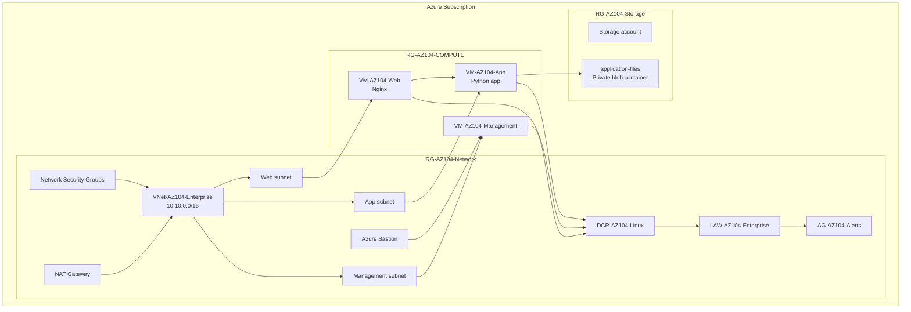

# Architecture Notes

This section documents the current AZ-104 enterprise administrator lab architecture as actually built and verified.

## Environment summary

| Area | Implemented resources |
| --- | --- |
| Subscription | Azure subscription `9e7bf3ca-eee3-4fae-a459-3f0b6c583d38` used during the lab. |
| Region | `centralindia` / Central India. |
| Network resource group | `RG-AZ104-Network`. |
| Compute resource group | `RG-AZ104-COMPUTE`. |
| Storage resource group | `RG-AZ104-Storage`. |
| VNet | `VNet-AZ104-Enterprise`, address space `10.10.0.0/16`, three subnets. |
| Compute | `VM-AZ104-Management`, `VM-AZ104-Web`, `VM-AZ104-App`. |
| Monitoring | `LAW-AZ104-Enterprise`, `DCR-AZ104-Linux`, `AG-AZ104-Alerts`, CPU alerts. |
| Storage | Storage account in `RG-AZ104-Storage` with private Blob container `application-files`. |

## Resource group design

The lab uses separate resource groups to mirror enterprise administration boundaries:

| Resource group | Purpose |
| --- | --- |
| `RG-AZ104-Network` | VNet, subnets, NSGs, Bastion, NAT Gateway, Log Analytics, DCR, and alerting resources. |
| `RG-AZ104-COMPUTE` | Linux virtual machines for management, web, and app tiers. |
| `RG-AZ104-Storage` | Storage account and Blob Storage resources. |

This separation supports cleaner RBAC, cost tracking, lifecycle management, and operational ownership.

## High-level architecture

## What was intentionally not added yet

- No storage private endpoint has been implemented yet.
- No SAS token lab has been completed yet.
- No backup/restore workflow has been completed yet.
- No Azure Policy or lock enforcement has been documented as completed yet.

Those are good next milestones, but they should be added only after they are actually configured and tested.
