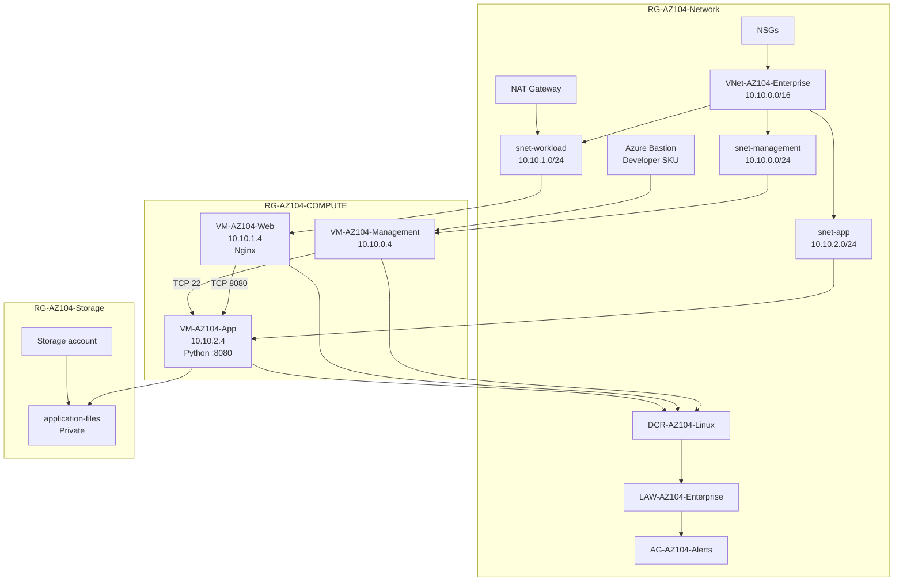

# Architecture Notes

This section documents the current AZ-104 enterprise administrator lab architecture as actually built and verified.

## Environment summary

| Area | Implemented resources |
| --- | --- |
| Region | `centralindia` / Central India |
| Network resource group | `RG-AZ104-Network` |
| Compute resource group | `RG-AZ104-COMPUTE` |
| Storage resource group | `RG-AZ104-Storage` |
| VNet | `VNet-AZ104-Enterprise`, `10.10.0.0/16` |
| Management subnet | `snet-management`, `10.10.0.0/24` |
| Web subnet | `snet-workload`, `10.10.1.0/24` |
| App subnet | `snet-app`, `10.10.2.0/24` |
| Compute | `VM-AZ104-Management`, `VM-AZ104-Web`, `VM-AZ104-App` |
| Secure access | Azure Bastion Developer SKU |
| Outbound connectivity | NAT Gateway associated with the workload subnet |
| Monitoring | `LAW-AZ104-Enterprise`, `DCR-AZ104-Linux`, `AG-AZ104-Alerts`, CPU alerts |
| Storage | Storage account with private Blob container `application-files` |

## Resource group design

| Resource group | Purpose |
| --- | --- |
| `RG-AZ104-Network` | VNet, subnets, NSGs, Bastion, NAT Gateway, Log Analytics, DCR, and alerting resources. |
| `RG-AZ104-COMPUTE` | Linux virtual machines for management, web, and app tiers. |
| `RG-AZ104-Storage` | Storage account and Blob Storage resources. |

This separation supports cleaner RBAC, cost tracking, lifecycle management, and operational ownership.

## Three-tier network

The VNet uses three logical tiers:

1. **Management tier** — administration and private SSH access.
2. **Web tier** — Nginx workload on TCP/80.
3. **App tier** — Python application service on TCP/8080.

The app VM has no public IP. Bastion and private network paths are used for administration.

## Implemented private IP layout

| VM | Tier | Private IP | Workload |
| --- | --- | --- | --- |
| `VM-AZ104-Management` | Management | `10.10.0.4` | Linux administration |
| `VM-AZ104-Web` | Web | `10.10.1.4` | Nginx |
| `VM-AZ104-App` | App | `10.10.2.4` | Python HTTP service |

## Traffic model

- Management → App TCP/22 is allowed for administration.
- Web → App TCP/8080 is allowed for application traffic.
- Web → App TCP/22 is intentionally not allowed.
- Web tier receives HTTP/80 and HTTPS/443 through its workload NSG.
- App tier is private and has no public IP.
- NAT Gateway provides outbound internet connectivity for the workload subnet.
- Azure Bastion provides browser-based private VM access.

## Monitoring architecture

All three VMs have Azure Monitor Agent installed.

`DCR-AZ104-Linux` collects:

- `Microsoft-Perf`
- `Microsoft-Syslog`

The destination is `LAW-AZ104-Enterprise`.

CPU alerts are configured for all three VMs and use `AG-AZ104-Alerts` for notification.

## Storage

The storage tier contains a private Blob container named `application-files`.

The lab validated:

- Storage firewall/network restrictions.
- Microsoft Entra-based Blob data access.
- `Storage Blob Data Reader` read/download access.
- Denied upload/delete operations for the reader identity.

Blob soft delete and container soft delete are enabled for 7 days. **Blob versioning is not enabled in the current implementation.**

## Architecture diagram

```mermaid
flowchart TB
    subgraph NetworkRG["RG-AZ104-Network"]
        VNet["VNet-AZ104-Enterprise<br/>10.10.0.0/16"]
        MgmtSubnet["snet-management<br/>10.10.0.0/24"]
        WebSubnet["snet-workload<br/>10.10.1.0/24"]
        AppSubnet["snet-app<br/>10.10.2.0/24"]
        Bastion["Azure Bastion<br/>Developer SKU"]
        NAT["NAT Gateway"]
        NSGs["NSGs"]
        LAW["LAW-AZ104-Enterprise"]
        DCR["DCR-AZ104-Linux"]
        AG["AG-AZ104-Alerts"]
    end

    subgraph ComputeRG["RG-AZ104-COMPUTE"]
        MgmtVM["VM-AZ104-Management<br/>10.10.0.4"]
        WebVM["VM-AZ104-Web<br/>10.10.1.4<br/>Nginx"]
        AppVM["VM-AZ104-App<br/>10.10.2.4<br/>Python :8080"]
    end

    subgraph StorageRG["RG-AZ104-Storage"]
        SA["Storage account"]
        Container["application-files<br/>Private"]
    end

    VNet --> MgmtSubnet
    VNet --> WebSubnet
    VNet --> AppSubnet
    MgmtSubnet --> MgmtVM
    WebSubnet --> WebVM
    AppSubnet --> AppVM
    Bastion --> MgmtVM
    NSGs --> VNet
    NAT --> WebSubnet
    WebVM -->|"TCP 8080"| AppVM
    MgmtVM -->|"TCP 22"| AppVM
    AppVM --> Container
    MgmtVM --> DCR
    WebVM --> DCR
    AppVM --> DCR
    DCR --> LAW
    LAW --> AG
    SA --> Container
```

## Future work

Not yet implemented:

- Storage private endpoint and Private DNS.
- SAS-based temporary Blob access.
- Backup/restore.
- Azure Policy, locks, and tagging enforcement.
- Infrastructure as Code conversion.
